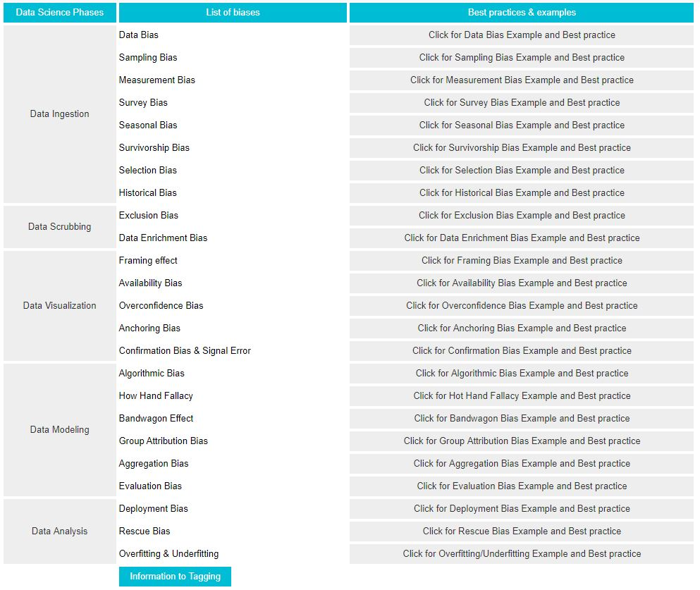
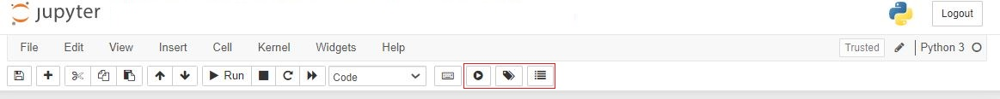
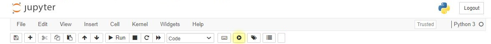
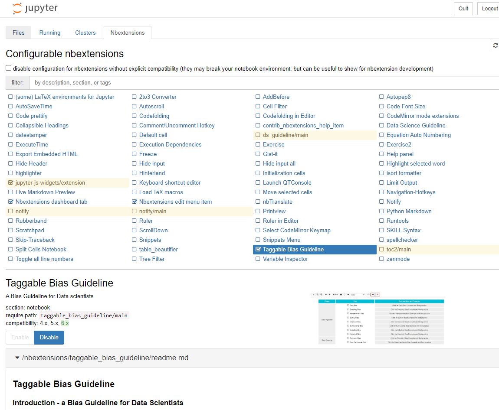

# A Tutorial Using the Juypter Notebook extension
Please be sure to have Python installed.

Requirements |  |
--- | --- |
Python3: | https://www.python.org/download/releases/3.0/ |
Microsoft Visual C++ 14.0 (or greater) | https://visualstudio.microsoft.com/downloads/#build-tools-for-visual-studio-2017|



**Note**: please use https://forms.gle/9oWTBhh87yBAd3XS8 to evaluate this extension. If there are any problems, feel free to add issues in this repository.

## Instruction on using guideline via script on Windows


Applied steps: |  |
--- | --- |
1. | download the "src" folder |
2. | run the "installation.bat" script to install the extension the first time | 
3. | after that, you can run the "startGuideline.bat" to start the guideline |
4. | **Create a new Python file** or open an existing jupyter notebook file. Those buttons should appear. |
5. | Click on **Start Button**('Start Guideline') to start guideline |


## (Alternatively) Instruction on using guideline via cmd
Applied steps: (per cmd)
1.  install **Jupyter notebook** (https://jupyter.org/install) (if not yet done)
2.  install **Jupyter notebook extensions** (https://jupyter-contrib-nbextensions.readthedocs.io/en/latest/install.html) 
3.  copy the folder **"taggable_bias_guideline"** and paste in **"nbextensions"** path e.g. at "C:\ProgramData\jupyter\nbextensions"
4.  Install **ipywidgets**(https://ipywidgets.readthedocs.io/en/latest/user_install.html)
```
pip install ipywidgets
```
5.  **Enable ipywidgets**
```
jupyter nbextension enable --py widgetsnbextension
```
6.  **Enable notebook extensions**
```
jupyter nbextensions_configurator enable --user
```

7. **Enable Guideline extension**
```
call jupyter nbextension enable taggable_bias_guideline/main
```

8.  **Start jupyter notebook**
```
jupyter notebook
```
9.  **Create a new Python file** or open an existing jupyter notebook file
10. Click on **Start Button**('Start Guideline') to start guideline


**Note:** make sure that the extension is enabled by observing the "Nbextensions" tab in the jupyter notebook.

## Extension
You will see a guideline with biases for each Data Science phase.
Additionally, there are links for description, examples and best practices to each bias. 
The link will redirect you to a Github page that provides this information. 

## Procedure
The guideline is for **education**(awareness of different biases) and **self-evaluation purposes**. It should give you an overview which biases can occur and show with examples how they can look like. 
### Tagging
If it occurs in your code bias, you can **tag the section** of the code (please see https://github.com/ikasu93/Data-Science-Bias-Guideline#tagging). You can also tag the section with the mitigation method. For this reason it makes sense to structure your code with ln[] to recognize sections that have been tagged with one or more tags.
### Create overview
After completing the implementation and the bias analysis, you have the possibility to create an overview of the tags or the biases and mitigation methods with the second button('Add summary'). This function serves as a temporary solution to give data scientists an overview of all keywords in their code.
The main purpose of this function is to allow you to access and save the tags using selectors.

